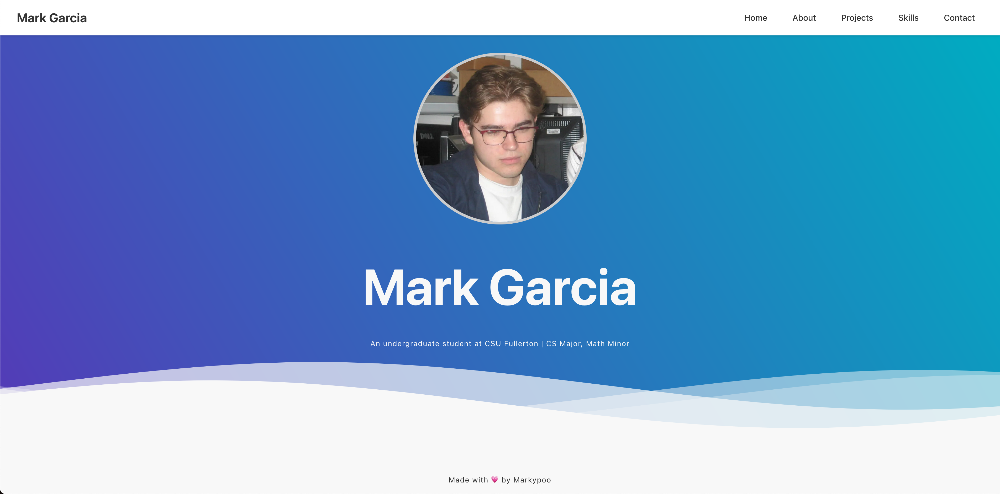

# Mark Garcia - Portfolio Website

 <!-- Add a screenshot later -->

A modern, responsive portfolio website built with React, TypeScript, and Vite. Features a dynamic header, smooth scrolling navigation, and a clean footer with social links.

## 🚀 Getting Started

### Prerequisites

``` Node.js (version 16 or higher)
    npm (comes with Node.js) or yarn
```

### Installation

1. Clone the repository:
   ```bash
   git clone https://github.com/MarkRyanGarcia/CPSC349-portfolio.git
   cd CPSC349-portfolio
   ```

2. Install dependencies:
   ```bash
   npm install
   # or
   yarn install
   ```

3. Run the development server:
   ```bash
   npm run dev
   # or
   yarn dev
   ```

4. Open in your browser:
   The app should automatically open in your default browser at:
   `http://localhost:5173`

## 🛠️ Available Scripts

``` npm run dev - Starts the development server
    npm run build - Builds the app for production
    npm run preview - Locally preview the production build
    npm run lint - Runs ESLint for code quality checking
```

## 📂 Project Structure

```
CPSC349-portfolio/
├── public/              # Static files
├── src/
│   ├── components/      # React components
│   │   ├── Header.tsx
│   │   ├── Home.tsx
│   │   ├── About.tsx
│   │   └── ...
│   ├── App.tsx          # Main application
│   └── main.tsx         # Entry point
├── index.html           # HTML template
├── vite.config.ts       # Vite configuration
└── package.json         # Project dependencies
```

## 🌟 Features

- Responsive design (works on all devices)
- Smooth scrolling navigation
- Dynamic header that changes on scroll
- Interactive footer with social links
- Fast performance with Vite
- TypeScript for type safety

## 🚀 Deployment

The project is deployed using [Vercel](https://vercel.com):

Click Here to View:
[](https://markg.dev/)

## 📝 License

This project is licensed under the MIT License - see the [LICENSE](LICENSE) file for details.

---

Made with ❤️ by Mark Garcia
